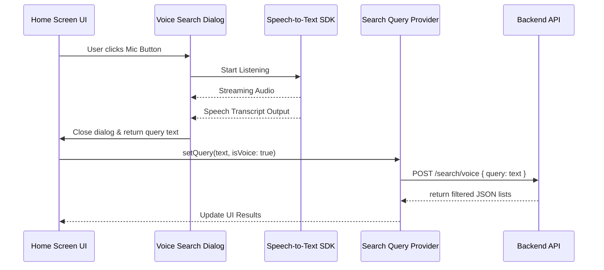

# LocaLink Mobile App Documentation
## Technical Architecture & Design Document

📄 **Project Title:** LocaLink - Local Business Directory & Registration Mobile Application  
📘 **Author:** Antigravity Developer Team  
🛠️ **Target Platform:** Cross-Platform Mobile (Android & iOS) using Flutter  

---

## Table of Contents
1. [Abstract](#-abstract)
2. [Introduction & Problem Statement](#-introduction--problem-statement)
3. [Objectives of the Mobile Platform](#-objectives-of-the-mobile-platform)
4. [Technology Stack Selection & Rationale](#-technology-stack-selection--rationale)
5. [System Directory & Clean Architecture layout](#-system-directory--clean-architecture-layout)
6. [Core Infrastructure & Utilities](#-core-infrastructure--utilities)
   - [Network Client Configuration (Dio)](#network-client-configuration-dio)
   - [Secure Storage Service](#secure-storage-service)
   - [App Theme & Design Tokens](#app-theme--design-tokens)
7. [Module Specifications & Code Design](#-module-specifications--code-design)
   - [1. Authentication & Session Module](#1-authentication--session-module)
   - [2. Routing & Navigation Shell](#2-routing--navigation-shell)
   - [3. Home Screen & Search Engine (with Voice Search)](#3-home-screen--search-engine-with-voice-search)
   - [4. Interactive Maps & Geolocation](#4-interactive-maps--geolocation)
   - [5. Business Registration Wizard (Modular Stepper)](#5-business-registration-wizard-modular-stepper)
   - [6. Advanced Reviews & AI Integration (Groq Hub)](#6-advanced-reviews--ai-integration-groq-hub)
   - [7. Real-Time Notifications (SignalR Service)](#7-real-time-notifications-signalr-service)
8. [Client-Side State Management (Riverpod Pattern)](#-client-side-state-management-riverpod-pattern)
9. [Development Setup & Local Networking](#-development-setup--local-networking)
10. [Git Workflow & Commit Guidelines](#-git-workflow--commit-guidelines)
11. [Testing & Quality Assurance](#-testing--quality-assurance)
12. [Conclusion & Future Enhancements](#-conclusion--future-enhancements)

---

## 📄 Abstract

The **LocaLink Mobile Application** is a high-performance cross-platform app designed to simplify local business discovery and registration. Acting as the mobile front-end counterpart to the LocaLink backend services, the application enables regular users to search for businesses near them, browse categorized service providers (such as medical facilities, food establishments, tutor listings, etc.), and view detailed business cards. Simultaneously, it allows local business owners (clients) to register, locate, and update their operational parameters directly from their mobile devices. 

By leveraging Flutter, the app delivers a unified interface that is fast, secure, and intuitive. It uses modern standards such as JSON Web Tokens (JWT) for secure data transactions, Maplibre GL for local map renderings, Speech-to-Text for voice searches, and Groq-powered AI models for generating structured summaries of reviews and enhancing draft review inputs.

---

## 📘 Introduction & Problem Statement

### Introduction
In an increasingly digitized economy, local businesses need immediate and accessible channels to connect with customers, and customers require a centralized tool to find services without clutter. The LocaLink mobile platform acts as a bridge, enabling immediate location-specific lookups. By deploying a mobile application, the user experience shifts from a stationary desktop layout to an on-the-go utility, utilizing physical device capabilities such as GPS hardware and microphone sensors.

### Problem Statement
Traditional local business discovery tools suffer from:
1. **Poor Mobile Adaptability:** Complex web interfaces that are slow or unusable on standard phones.
2. **Missing Real-Time Channel:** Lack of instant feedback when a business registration changes or a review is posted.
3. **Data Entry Friction:** Tedious manual entry of latitude, longitude, and physical addresses during registration.
4. **Vague Review Content:** Text-heavy, unstructured customer feedback that is difficult to digest quickly.

LocaLink solves these problems by incorporating mobile-first features like device location fetching, auto-reverse geocoding, voice-controlled searching, and AI-generated review summarization.

---

## 🎯 Objectives of the Mobile Platform

* **Unified UX/UI:** Provide a dark, luxurious editorial look (using a Gold-on-Black color palette) with smooth transitions.
* **On-the-Go Discovery:** Allow users to search by category and subcategory instantly.
* **Low-Friction Registration:** Empower business owners to configure their profile details using a guided step-by-step wizard.
* **Device Sensor Integration:** Integrate hardware sensors (GPS via Geolocator, Voice Microphone via Speech-to-Text) directly into the UI flows.
* **Intelligent Review Processing:** Summarize multiple comments into single-sentence insights and enhance user drafts using generative AI.
* **Instant Backend Syncing:** Implement persistent WebSocket channels for notification delivery.

---

## 🛠️ Technology Stack Selection & Rationale

| Technology / Package | Version | Purpose | Rationale |
| :--- | :--- | :--- | :--- |
| **Flutter SDK** | `^3.12.2` | Core Application Framework | Allows compiling to high-performance native binaries for both Android and iOS from a single codebase. Native compilation yields 60+ FPS UI rendering via Impeller/Skia. |
| **Dart** | `^3.x` | Programming Language | Object-oriented, statically-typed language with strong null safety and modern asynchronous constructs (Futures/Streams). |
| **Dio** | `^5.10.0` | HTTP Client | Features advanced configurations like global request/response interceptors, request timeouts, and custom error handling that are missing in the standard `http` package. |
| **Flutter Riverpod** | `^3.3.2` | State Management | Provides a unidirectional, compile-safe, testable state management container. Decouples business logic from the UI lifecycle and avoids the boilerplate of BLoC. |
| **GoRouter** | `^17.3.0` | Declarative Routing | Direct integration with Flutter navigation. Easily manages complex shell structures (nested navigation stacks) and URL parameter handling. |
| **Flutter Secure Storage** | `^9.2.2` | Keychain / Keystore Access | Encrypts and persists sensitive key-value pairs (auth token, user roles, user ID) in secure system partitions (Keychain on iOS, AES-encrypted SharedPreferences on Android). |
| **Maplibre GL** | `^0.26.2` | Map Renderer | Native vector tile map renderer. Free, customizable, open-source, and does not require expensive commercial SDK billing plans (e.g. Google Maps API keys). |
| **Speech to Text** | `^7.4.0` | Voice Processing | Wraps device-native speech recognition models (Siri on iOS, Google Speech Services on Android) for real-time voice-to-text conversion. |
| **SignalR Netcore** | `^1.4.4` | WebSocket Connection | Connects the mobile app to ASP.NET Core SignalR hubs for persistent, low-overhead push notifications. |
| **Geolocator** | `^14.0.2` | GPS Coordinator | Handles platform-specific permissions and fetches highly accurate GPS coordinates directly from the device's geolocation hardware. |

---

## 🏗️ System Directory & Clean Architecture Layout

The mobile application utilizes a **Feature-First / Clean Architecture** folder structure, dividing the code into self-contained feature modules and a shared base folder. This maintains a clean separation of concerns:

```
localink_mobile/
├── android/                   # Native Android configuration
├── ios/                       # Native iOS configuration
├── assets/                    # Static resources (images, fonts)
└── lib/
    ├── main.dart              # App Entry Point & Router Initialization
    ├── core/                  # Core shared infrastructure
    │   ├── network/           # API Client (DioClient), SignalR Service
    │   ├── storage/           # Secure Storage (Keychain/Keystore) interface
    │   └── theme/             # Styling guidelines & custom themes (AppTheme)
    └── features/              # Feature modules
        ├── auth/              # Authentication & User Profiles
        │   ├── data/          # Auth Repositories, Request/Response DTO Models
        │   ├── presentation/  # Screens (Login, Sign-Up, Profile) & widgets
        │   └── providers/     # Riverpod providers for auth state control
        ├── business/          # Core Business Operations
        │   ├── data/          # Business Models (Category, Subcategory, Business DTO, Review DTO)
        │   ├── presentation/  # Screens (Home, Detail, Registration wizard, Favorites)
        │   └── providers/     # Search and CRUD State providers
        └── shared/            # Reusable UI features
            └── presentation/  # Main Bottom Navigation Shell (MainShell)
```

---

## ⚙️ Core Infrastructure & Utilities

### Network Client Configuration (Dio)
HTTP communications are centralized inside [DioClient](file:///C:/Users/ANCHURU%20SANKEERTH/Internship-Project/localink_mobile/lib/core/network/dio_client.dart). It dynamically updates the base URL depending on whether the app is executing on the web, on a physical debugger, or on an Android emulator:
* **Android Emulator Host Loopback:** Uses `10.0.2.2` to route requests to the computer's localhost.
* **Physical Device (USB Debugging / Wi-Fi):** Configured to hook into the computer's LAN IP address (`192.168.0.106`) or use reverse port mapping (`adb reverse tcp:5138 tcp:5138`).
* It sets 10-second request/receive timeouts and adds a logging interceptor for active debugging.

### Secure Storage Service
Key credentials are managed by [SecureStorageService](file:///C:/Users/ANCHURU%20SANKEERTH/Internship-Project/localink_mobile/lib/core/storage/secure_storage_service.dart). It stores the following keys:
1. `jwt_token`: The authentication token included in the `Authorization: Bearer <token>` header of secured requests.
2. `user_type`: Identifies whether the logged-in account is a `Client` (business owner) or standard `User` to redirect them during app startup.
3. `user_id`: Numeric identifier utilized to subscribe to user-specific real-time SignalR notification groups.

### App Theme & Design Tokens
Designed to look modern, clean, and premium, [AppTheme](file:///C:/Users/ANCHURU%20SANKEERTH/Internship-Project/localink_mobile/lib/core/theme/app_theme.dart) configures a dark-mode theme utilizing:
* **Background:** Deep rich black (`Color(0xFF050505)`)
* **Surfaces & Cards:** Dark charcoal (`Color(0xFF1C1C1C)`)
* **Accent / Gold Highlight:** Warm brass gold (`Color(0xFFC8A97E)`)
* **Typography:** `Inter` font family configured with clean, geometric weights.
* **Input Fields:** Dark gray filled borders that scale to a gold outline when active.

---

## 🧩 Module Specifications & Code Design

### 1. Authentication & Session Module
The authentication system supports role-based dashboards, secure token storage, and input sanitization:
* **Password Obscuring:** Form fields secure password inputs via `obscureText` toggle switches.
* **Email & Password Validation:** Client-side regular expression checks validate inputs before dispatching API requests.
* **JWT Storage Integration:** Upon successful login at the `auth/sessions` endpoint, the token is saved, and the state changes to `AuthAuthenticated`.
* **Captcha Bypass:** A hardcoded bypass parameter is passed in the mobile repository request payload to skip web-centric captcha screens on mobile devices.

### 2. Routing & Navigation Shell
Routing is declared inside [main.dart](file:///C:/Users/ANCHURU%20SANKEERTH/Internship-Project/localink_mobile/lib/main.dart) using a declarative **GoRouter** structure:
* **Redirect Logic:** A router redirect watcher monitors `authProvider`. If the state is unauthenticated, the user is locked out and redirected to `/login`. Once authenticated, standard users go to `/home` while business clients are routed to `/business-dashboard`.
* **Nested Tab Navigation:** Standard users browse the application using a tab bar. To prevent state loss when toggling tabs, we implement `StatefulShellRoute.indexedStack` (with `MainShell`) containing:
  1. `/home`: The discovery grid and voice search interface.
  2. `/favorites`: The list of saved local listings.
  3. `/profile`: The profile dashboard and logout triggers.

### 3. Home Screen & Search Engine (with Voice Search)
The [HomeScreen](file:///C:/Users/ANCHURU%20SANKEERTH/Internship-Project/localink_mobile/lib/features/business/presentation/screens/home_screen.dart) acts as the primary hub for search:
* **Voice Search Dialog:** Pressing the microphone triggers the native speech recognizer. Users speak their queries (e.g. *"Dentist in Mumbai"*), and the voice dialog streams and displays the transcript. Upon completion, it returns the text, auto-populates the search bar, and fires the `search/voice` backend query.
* **Dynamic Search & Categories:** Key updates in the search field trigger updates in the `searchQueryProvider`. The `searchResultsProvider` automatically recalculates and fires a new debounced API search request. Users can also filter results by selecting Category chips.



### 4. Interactive Maps & Geolocation
Integrating geolocation streamlines navigation and ensures accurate address data:
* **Geolocator GPS Fetch:** Clicking the "My Location" button requests device GPS permissions and queries device GPS sensors to fetch the current latitude and longitude.
* **Auto-Reverse Geocoding:** The coordinates are sent to the **Geoapify API** via HTTPS:
  ```
  GET https://api.geoapify.com/v1/geocode/reverse?lat=LATITUDE&lon=LONGITUDE&format=json&apiKey=YOUR_KEY
  ```
  The API returns structured components (street name, house number, state, country, pincode), which are used to auto-populate the registration form.
* **Interactive Leaflet/MapLibre GL Map:** An interactive vector map is rendered inside the registration stepper. Clicking anywhere on the map changes the active marker coordinates (`_latitude`, `_longitude`) dynamically.

### 5. Business Registration Wizard (Modular Stepper)
To reduce cognitive load on users filling out long forms, registration is structured as a **4-step Wizard**:
1. **Basic Info:** Business Name, Description, and cascading Category and Subcategory dropdown selectors.
2. **Contact & Location:** Phone numbers, Email, physical Street Address, Country, State, City selectors, and the MapLibre coordinate selector map.
3. **Operational Info:** Operating hours configuration (an interactive weekly schedule where users can set days as "Open" or "Closed" and choose open/close times) and a photo upload placeholder.
4. **Preview & Submit:** Renders a summary card of the configurations. Submitting sends a POST request to `business/register` or a PUT request to `business/:id` if editing.

### 6. Advanced Reviews & AI Integration (Groq Hub)
Inside the [BusinessDetailScreen](file:///C:/Users/ANCHURU%20SANKEERTH/Internship-Project/localink_mobile/lib/features/business/presentation/screens/business_detail_screen.dart), reviews are augmented with generative AI using Groq API endpoints:
* **AI Reviews Summary:** If a business has reviews, the screen automatically makes a POST request to `ai/review-summary`, sending a list of all user comments. The server processes these comments using an LLM (e.g. Llama 3) and returns a concise, single-sentence summary (e.g. *"Customers frequently praise the service but note that parking is limited"*). This summary is displayed at the top of the reviews section.
* **AI Enhance (Review Draft Suggestions):** Users writing a review can tap "AI Enhance". The app sends their draft comment and rating to the `ai/review-suggestions` endpoint. The server returns a list of three polished suggestions. Selecting a suggestion applies it to the comment box.

```
       [ Draft Comment ] + [ Rating ] + [ Business Name ]
                             │
                             ▼
                    POST /ai/review-suggestions
                             │
                             ▼ (Server processes via LLM)
       [ Suggested Option 1 ] [ Suggested Option 2 ] [ Suggested Option 3 ]
                             │
                             ▼ (User Taps Option)
                     [ Applied to Input ]
```

### 7. Real-Time Notifications (SignalR Service)
Real-time messaging is handled by [SignalRService](file:///C:/Users/ANCHURU%20SANKEERTH/Internship-Project/localink_mobile/lib/core/network/signalr_service.dart):
* On user login, the service establishes a persistent socket connection to the `/notifications` WebSocket hub.
* Once connected, the app calls `JoinGroup` on the hub to register a client-specific group: `client_<userId>`.
* The hub pushes messages to this group when events occur (e.g. a new review is posted).
* When a message is received, the app triggers a floating, real-time `SnackBar` with an alert icon to notify the user.

---

## 🔗 Client-Side State Management (Riverpod Pattern)

State in the application is managed via unidirectional Riverpod providers, which decouple business logic from the UI:

```
                  +---------------------------+
                  |    SearchQueryNotifier    | (Monitors active query, categories)
                  +-------------+-------------+
                                |
                                ▼
+--------------------+    +-----+-----+    +---------------------------+
| BusinessRepository |--->|  searchResultsProvider  |--->|    Home Screen UI Widgets     |
+--------------------+    +-----------+------------+    +---------------------------+
```

* **`authProvider`**: A `NotifierProvider` tracking `AuthState` (`AuthInitial`, `AuthLoading`, `AuthAuthenticated`, `AuthUnauthenticated`, `AuthError`). It handles authentication requests and updates GoRouter navigation.
* **`myBusinessesProvider`**: An `AsyncNotifierProvider` that manages the logged-in client's business profiles. It handles CRUD requests and triggers UI refreshes.
* **`searchQueryProvider`**: Maintains the search state, including queries, category selections, voice search flags, and coordinates.
* **`searchResultsProvider`**: A `FutureProvider` that watches `searchQueryProvider`. If the query updates, it fetches filtered results from the repository and updates the UI automatically.
* **`favoritesProvider`**: A `NotifierProvider` tracking business IDs favorited by the user, updating the heart icons on business lists in real-time.

---

## ⚙️ Development Setup & Local Networking

To run the mobile application locally and connect it to the backend APIs:

1. **Verify Backend Connection:**
   Ensure the .NET Backend API is running on port `5138` and listening on all network interfaces:
   ```json
   "localink_be": {
     "commandName": "Project",
     "launchBrowser": true,
     "launchUrl": "swagger",
     "applicationUrl": "http://0.0.0.0:5138",
     "environmentVariables": {
       "ASPNETCORE_ENVIRONMENT": "Development"
     }
   }
   ```
2. **Configure Host IP:**
   Update the `backendHost` constant in [DioClient](file:///C:/Users/ANCHURU%20SANKEERTH/Internship-Project/localink_mobile/lib/core/network/dio_client.dart) with your local machine's IP address:
   ```dart
   static const String backendHost = '192.168.0.106'; // Your local network IP
   ```
3. **Configure the Android Emulator:**
   If using the Android Emulator, map the ports to forward local traffic to the host machine:
   ```powershell
   adb reverse tcp:5138 tcp:5138
   ```
4. **Install Dependencies & Build Code:**
   Fetch dependencies and run build_runner to generate serializer classes:
   ```powershell
   flutter pub get
   flutter pub run build_runner build --delete-conflicting-outputs
   ```
5. **Run the App:**
   Start the application on your connected device or emulator:
   ```powershell
   flutter run
   ```

---

## 🔄 Git Workflow & Commit Guidelines

The development cycle uses a structured Git workflow to ensure clean repository history:

1. **Create Feature Branch:**
   ```powershell
   git checkout main
   git pull origin main
   git checkout -b feature/auth-secure-storage
   ```
2. **Make Changes & Check Status:**
   ```powershell
   git status
   ```
3. **Stage & Commit Changes:**
   Write descriptive commit messages detailing changes:
   ```powershell
   git add .
   git commit -m "feat(auth): integrate flutter_secure_storage for token management"
   ```
4. **Push Branch to Origin:**
   ```powershell
   git push origin feature/auth-secure-storage
   ```
5. **Merge to Main:**
   Merge changes via Pull Request on GitHub, or locally:
   ```powershell
   git checkout main
   git merge feature/auth-secure-storage
   git push origin main
   ```

---

## 🧪 Testing & Quality Assurance

Quality assurance covers both the frontend and backend components:

### Backend (.NET API)
* **Frameworks:** xUnit, Moq (for mocking services), and Fluent Assertions (for readable assertions).
* **Focus:** Tests core business logic, validator behaviors, and HTTP endpoint routing.

### Frontend (Flutter)
* **Frameworks:** Jasmine and Karma (configured in testing runner suites) or standard `flutter_test` packages.
* **Focus:** Validates form validations, state flows in Riverpod providers, and core UI rendering.

---

## 🚀 Conclusion & Future Enhancements

The LocaLink Mobile Application delivers a complete, secure, and modern local business directory interface. Built on a clean architecture using Flutter and Riverpod, the app is highly maintainable and ready for production. 

### Future Enhancements
1. **Push Notifications:** Integrate Firebase Cloud Messaging (FCM) or Apple Push Notification service (APNs) for system notifications when the app is closed.
2. **Offline Mode:** Implement local caching using SQLite or Hive databases to let users browse listings offline.
3. **Advanced Filtering:** Add filtering options to sort businesses by distance, ratings, and operating status (e.g. open now).
4. **Enhanced Media Support:** Add multi-photo uploads and image compression before sending files to the server.
