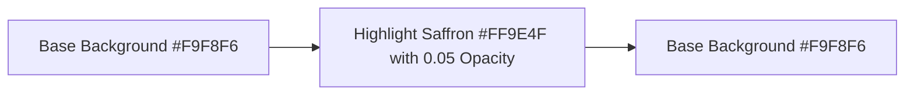

# Motion Guidelines: Localink Mobile App
Version 2.0.0 • Animation & Motion Design Specifications

Motion in the Localink application is designed to be purposeful, minimal, and premium. Animation should feel natural, responsive, and provide visual feedback to user choices without introducing lag or delay.

---

## 1. Timing & Interpolation Curves

To maintain a consistent physical feel, all custom animations must utilize these standardized durations and curve profiles.

### A. Durations
*   **duration-instant** (0ms): Instantaneous visual updates.
*   **duration-short** (150ms): Hover indicators, active tab indicator movements, simple checks, scale presses.
*   **duration-medium** (250ms): Navigation page transitions, bottom sheet slides, scale-ins on modal dialogs.
*   **duration-long** (400ms): Expandable filters list disclosures, custom onboarding canvas paint overlays, complex transitions.

### B. Interpolation Curves
*   **curve-standard** (`Curves.easeInOutCubic`): Default choice for standard position/opacity transitions. Smooth acceleration and deceleration.
*   **curve-decelerate** (`Curves.easeOutCubic`): Enters the screen quickly and slows down at the end. Recommended for dialog entry and snackbars.
*   **curve-accelerate** (`Curves.easeInCubic`): Starts slowly and leaves the screen quickly. Recommended for dismissals and exits.
*   **curve-overshoot** (`Curves.easeOutBack`): Elastic bounce-back effect. Excellent for scale-in actions (e.g. favorite heart click state selection).

---

## 2. Page & Element Transitions

### A. Slide & Fade (Tab Selection Switches)
To smooth out screen switches inside GoRouter's stateful branches, replace instant stack swaps with a subtle slide-and-fade transition:
```dart
class SlideFadeTransition extends PageRouteBuilder {
  final Widget child;

  SlideFadeTransition({required this.child})
      : super(
          pageBuilder: (context, animation, secondaryAnimation) => child,
          transitionsBuilder: (context, animation, secondaryAnimation, child) {
            return SlideTransition(
              position: Tween<Offset>(
                begin: const Offset(0.02, 0.0), // subtle horizontal entry from right
                end: Offset.zero,
              ).animate(CurvedAnimation(parent: animation, curve: Curves.easeOutCubic)),
              child: FadeTransition(
                opacity: animation,
                child: child,
              ),
            );
          },
        );
}
```

### B. Hero Transition (Detail Header Scaling)
*   **Use Case:** Transitioning a thumbnail image from the search results card on `HomeScreen` directly into the banner on `BusinessDetailScreen`.
*   **Rule:** Images must be wrapped in matching `Hero` widgets with unique keys (e.g. `hero-image-${businessId}`). The transition handles aspect ratio and boundary scaling automatically.

### C. Scale Animation (Dialogs Entry)
Dialog popups must scale up from `0.85` scale factor while fading in:
```dart
ScaleTransition(
  scale: CurvedAnimation(parent: animation, curve: Curves.easeOutBack),
  child: FadeTransition(opacity: animation, child: child),
);
```

---

## 3. Micro-Interactions

### A. Scale Press Visual Feedback
Every primary button, icon-button, and card wrapper should scale down slightly when pressed, simulating physical compression:
*   On touch down: Animated shrink to `0.96` scale factor over `100ms`.
*   On touch release: Animated recovery to `1.0` scale factor over `150ms`.

### B. Premium Ripple (Ink Splash)
All clickable surfaces must display a clean material ripple:
*   **Splash Color:** `color-accent-saffron` with `0.1` opacity (`Color(0xFFFF9E4F).withOpacity(0.1)`).
*   **Highlight Color:** Transparent.
*   This avoids dark default gray overlays on white cards, maintaining a premium look.

---

## 4. Shimmer Loading & Skeleton Specs

Skeleton frames act as placehold templates during server network loading. Skeletons must animate in a continuous linear sweeping gradient.



### Shimmer Specs:
*   **Base Color:** `Color(0xFFF9F8F6)` (Secondary Background fill).
*   **Highlight Color:** `Color(0xFFEAE8E3)` (Subtle Border Gray).
*   **Sweep Angle:** `-30` degrees.
*   **Duration Period:** `1500ms` infinite loop.
*   **Animation Curve:** Linear gradient sweep (`Curves.linear`).
*   **Corner Shape:** Skeletons must match the exact boundary radius (`radius-md` or `radius-lg`) of the actual component they represent.
