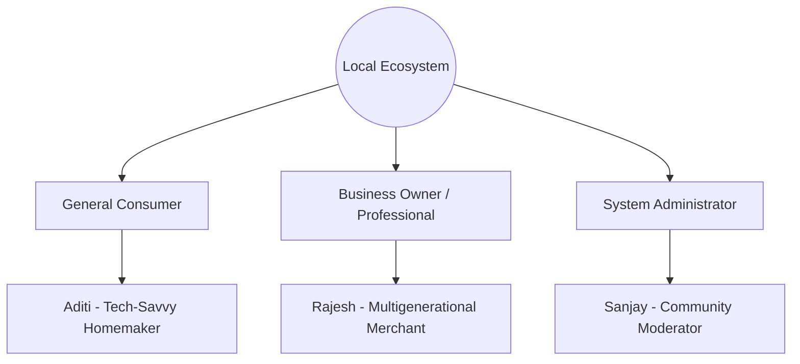

# Product Vision: Vocal for Sanatan
Version 1.0.0 • Product Strategy & Core Foundations

## 1. Mission & Vision

### Mission
To empower communities by building a trusted bridge of discovery between users and local businesses, organizations, and professionals. Vocal for Sanatan exists to champion local entrepreneurship, foster trust-based community commerce, and deliver modern convenience with a welcoming, premium digital experience.

### Vision
To become the ultimate single source of truth for local discovery and community trust—redefining how people find, verify, and connect with their local ecosystem while promoting community resilience, mutual growth, and authentic relationships.

---

## 2. Target Users & Personas

Our platform serves three key segments: local consumers, local business owners/professionals, and system administrators.

### Persona 1: General Consumer (Aditi, 34)
*   **Bio:** Tech-savvy homemaker and mother of two. Wants to source organic groceries, reliable tutors, and trust-verified professionals in her neighborhood.
*   **Needs:** Easy verification, search typo tolerance, distance calculation, child-safe recommendations, and family-focused service verification.
*   **Frustrations:** False online reviews, outdated business hours, and lack of direct contact routes.

### Persona 2: Business Owner / Professional (Rajesh, 48)
*   **Bio:** Runs a traditional family hardware shop. Wants to grow his digital presence without paying high commissions.
*   **Needs:** Simple setup, quick closure toggle options, clear analytics, and review response channels.
*   **Frustrations:** High commission platforms, complex listing wizards, and delayed feedback loops.

### Persona 3: System Administrator / Moderator (Sanjay, 29)
*   **Bio:** Compliance manager. Monitors business registrations and handles complaints.
*   **Needs:** Unified dashboards, heatmaps of activity, quick review buttons, and audit trail records.
*   **Frustrations:** Messy data formats and lack of geolocation context.

---

## 3. Product & Business Goals

### Product Goals
1.  **Zero-Latency Search:** Provide Google Maps-like discovery speed, resolving partial names, owners, and streets instantly.
2.  **Conversational Discovery:** Bridge standard search patterns using a smart Llama-powered AI assistant returning interactive cards.
3.  **Low Friction Onboarding:** Provide an unauthenticated search path while keeping login/signup processes under 60 seconds.

### Business Goals
1.  **High Retention:** Achieve 60%+ 30-day user retention through personalized smart suggestions, seasonal collections, and local notifications.
2.  **Trust Authority:** Establish the "Verified Badge" as the gold standard for vendor authenticity in the region.
3.  **Zero Commission Growth:** Support direct customer-to-owner calls and directions without middleman fees, creating strong merchant loyalty.

---

## 4. Brand Identity & Personality

Our brand represents modern technology blended with traditional community trust.

*   **Theme Palette:** Premium White background representing transparency and clarity, accented by Saffron and Orange representing warmth, energy, and community.
*   **Personality Attributes:**
    *   *Intelligent:* Utilizes semantic AI search, predictive maps, and analytics.
    *   *Welcoming:* Friendly typography, personal greetings, and soft round corners.
    *   *Premium:* Clean layouts, smooth micro-animations, and zero clutter.
    *   *Authentic:* Strict verification processes and verified owner credentials.

---

## 5. Target User Emotions

The user journey is engineered to evoke specific feelings at critical touchpoints:
*   **Onboarding:** *Curiosity and reassurance.* The app is here to simplify, not complicate.
*   **Search & Discovery:** *Control and competence.* Finding a provider feels effortless.
*   **Verification & Profile:** *Security and trust.* The verified badge provides peace of mind.
*   **AI Chat interaction:** *Delight and amazement.* The assistant understands intent instantly.

---

## 6. Competitive Advantages

| Feature | Vocal for Sanatan | Traditional Directories | E-Commerce Platforms |
| :--- | :--- | :--- | :--- |
| **Trust Model** | Direct owner verification + manual admin review | Low/Unverified listings | Purely transactional |
| **Middleman Fees** | 0% commission on lead discovery | Expensive sponsored bids | 15% - 30% take-rate |
| **AI Integration** | Conversation + interactive business cards | Basic keyword filter | Purely sales recommendation |
| **Search Detail** | Down to streets, landmarks, and zones | City-level general matches | Global products catalog |

---

## 7. Operating Philosophies

### A. Navigation Philosophy
Flat, transparent hierarchy. Minimize deep screen stacks. Major branches (Home, Favorites, AI Chat, Support/Feedback) remain anchored to the bottom shell navigator, letting users switch context with a single tap.

### B. Accessibility Philosophy
Accessibility is not a feature; it is a baseline. All layouts support dynamic text scaling, maintain a minimum contrast ratio of `4.5:1` (meeting WCAG 2.1 AA standards), and target `48dp` minimum dimensions for touch interactions.

### C. Performance Philosophy
All visual assets are lightweight vectors. Network requests operate asynchronously with shimmer skeleton loaders. The app stays responsive even during poor cellular connectivity via cache-first strategies.

### D. Trust Principles
*   **Owner Accountability:** Every listing shows the Business Owner's name, establishing personal responsibility.
*   **Transparency:** Users must see why a store is closed or marked pending.
*   **Data Integrity:** Auto-validating addresses against verified postal registries.
